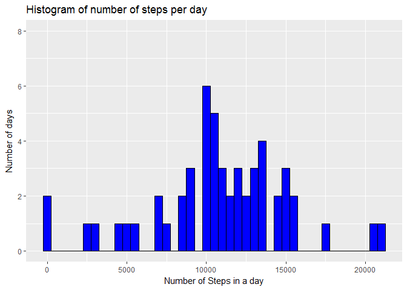
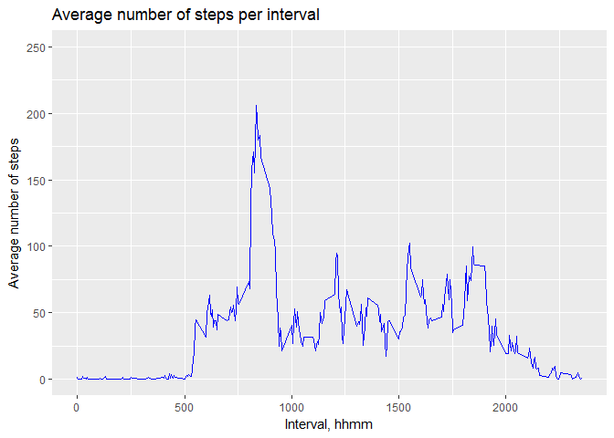
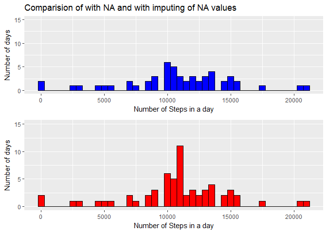
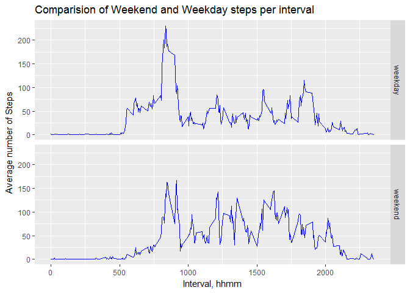

# Reproducible Research: Peer Assessment 1


## Loading and preprocessing the data

```r
# Load the necessary libraries
library(ggplot2)
suppressMessages(suppressWarnings(library(gridExtra)))
suppressMessages(suppressWarnings(library(dplyr)))
# Read the data 
activity <- read.table("activity.csv",
                       header=TRUE,quote="\"", sep=",",
                       colClasses=c("integer","Date","integer"))
```
Summarize the data, to assess whether there are missing values, range and number of values.

```r
str(activity)
```

```
## 'data.frame':	17568 obs. of  3 variables:
##  $ steps   : int  NA NA NA NA NA NA NA NA NA NA ...
##  $ date    : Date, format: "2012-10-01" "2012-10-01" ...
##  $ interval: int  0 5 10 15 20 25 30 35 40 45 ...
```

```r
summary(activity$steps)
```

```
##    Min. 1st Qu.  Median    Mean 3rd Qu.    Max.    NA's 
##    0.00    0.00    0.00   37.38   12.00  806.00    2304
```
Ploting a histogram of the number of steps per day. The aggregate function does not return any day which has all NA values.


```r
day_total <- aggregate(steps ~  date, data=activity, sum)
ggplot(day_total,aes(steps)) + 
      geom_histogram(binwidth=500,fill="blue",colour="black") + 
      xlab("Number of Steps in a day") + 
      ylab("Number of days") + 
      ylim(0,8) +
      ggtitle("Histogram of number of steps per day")
```

<!-- -->

## What is mean total number of steps taken per day?
The mean total number of steps taken per day is 10766 steps. The median total number of steps taken per day is 10765 steps


## What is the average daily activity pattern?
Use the aggregate function to find the mean for each interval (0000 to 2355).

```r
interval_mean <- aggregate(steps ~ interval, data=activity, mean)
ggplot(interval_mean,aes(interval,steps)) + 
      geom_line(color="blue") + 
      xlab("Interval, hhmm") +
      ylab("Average number of steps") +
      ylim(0,250) +
      ggtitle("Average number of steps per interval")
```

<!-- -->
The maximum number of steps occurs in the interval 835 

## Imputing missing values

The number of rows with NA values is 2304. A simple approach for imputing missing values is to replace any interval NA values with the average value for that interval across all the measurements. 

```r
activity_no_NA <- merge(x=activity, y=interval_mean, by="interval")
activity_no_NA <- mutate(activity_no_NA, steps = ifelse(is.na(steps.x)==TRUE,steps.y,steps.x))
# Drop the steps.x and steps.y columns
activity_no_NA <- subset(activity_no_NA,select = -c(steps.x,steps.y))
activity_no_NA <- activity_no_NA[order(activity_no_NA$date,activity_no_NA$interval),]

day_total_no_NA <- aggregate(steps ~  date, data=activity_no_NA, sum)
plot1<-ggplot() + 
      geom_histogram(data=day_total,aes(steps),binwidth=500,fill="blue",colour="black") +
      xlab("Number of Steps in a day") + 
      ylab("Number of days") +ylim(0,15) +ggtitle("Comparision of with NA and with imputing of NA values")

plot2<- ggplot() + 
      geom_histogram(data=day_total_no_NA,aes(steps),binwidth=500,fill="red",colour="black") +
      xlab("Number of Steps in a day") + 
      ylab("Number of days") +ylim(0,15)

 grid.arrange( plot1, plot2, nrow=2)
```

<!-- -->
By observation, the bin centred on 11000 has increased its count by 8 days, representing the number of days that were filled with NA values.
For the data set with the NA values replaced with the interval's mean value, the mean =  10766 (was 10766 ) and the median value is 10766 (was 10765 ).
There is little change to these statistics through the replacement of NA with the mean value for each interval.

## Are there differences in activity patterns between weekdays and weekends?

```r
# Assign the day of week based on the the measurement was taken
activity_no_NA$day_of_week <- weekdays(activity_no_NA$date)
# assign the grouping,day_type for 'weekend' if the day of week is Saturday or Sunday; everything else is a week day
 activity_no_NA$day_type <- ifelse(activity_no_NA$day_of_week=="Sunday"|activity_no_NA$day_of_week=="Saturday","weekend","weekday")
 # Add the day_type as a factor to the data.frame
 activity_no_NA$day_type <- as.factor(activity_no_NA$day_type)
 # Aggregate based on interval, mean of steps and  day_type as a factor.
 interval_mean_day_type <- aggregate(cbind(steps) ~ interval + day_type, data=activity_no_NA, mean)
 ggplot(interval_mean_day_type,aes(x=interval,y=steps)) +
       geom_line(color="blue") + 
       facet_grid(day_type~.) +
       ggtitle("Comparision of Weekend and Weekday steps per interval") +
   xlab("Interval, hhmm") + 
      ylab("Average number of Steps")
```

<!-- -->
The two line plots show that the subject has a higher, more compressed steps per interval early in the day for the weekdays. The number of steps per interval for the weekends has a larger spread compared to the weekdays graph.
 
